# 部署 ASP.NET Core 應用程式到 Azure Docker VM #

ASP.NET Core 是新一代的 .NET Core 的 Web 開發平台，它除了能跑在 Windows 平台外，
亦能執行於 OSX 與 Linux 的環境，ASP.NET Team 也為它實作了 Docker Image 供開發人員使用，
目前 Azure 已經能使用 Ubuntu Linux 部署 Docker 的應用程式，因此本次實驗即是利用 Visual Studio
以及 Docker 工具將 ASP.NET Core 應用程式部署到 Azure 的 Docker VM 裡面，以體驗 Docker 與 Azure
的整合。

本次實驗所需的工具有：

1. Visual Studio 2015 (可以是 Community Edition)，建議使用 Update 1 以上版本。
2. [Docker Toolbox](https://www.docker.com/products/docker-toolbox)
3. [Visual Studio Tools for Docker](https://visualstudiogallery.msdn.microsoft.com/0f5b2caa-ea00-41c8-b8a2-058c7da0b3e4)

## 工作 1. 取得與安裝所需軟體 ##

1. 取得所需軟體，包含 Docker Toolbox 以及 Visual Studio Tools for Docker，並且註冊或取得 Azure 帳戶
(例如 Azure 試用帳戶、Azure Pass 或是 MSDN Azure Credits 皆可)。
2. 若有需要，可使用 Web Platform Installer 安裝 Azure SDK v2.9, Azure PowerShell 以及 Azure CLI 等工具。

注意：部份工具安裝完成時需要重開機。

## 工作 2. 建立 ASP.NET Core 專案 ##

此工作將建立 ASP.NET Core 專案，編寫此實作時採用的版本為 1.0.0-rc1-update1。

### Step 1. ###
啟動 Visual Studio 2015，開啟完成後選擇檔案 -> 新增 -> 專案，在新增專案對話盒中選擇 Visual C# -> Web
，確定 .NET Framework 是 4.6.1，然後選 ASP.NET Web 應用程式，若右邊的 Application Insights 有勾選，
請先點掉 (因為用不到)，然後按確定。

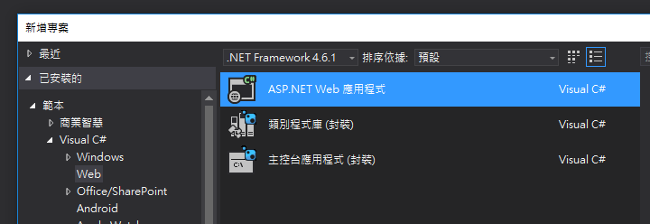

### Step 2. ###
在新增 Web 專案視窗，選擇 ASP.NET 5 範本，可選擇 Empty 或是 Web Application，這會影響後面部署完成後
看到的畫面，在實驗中選擇 Web Application，若旁選的 Microsoft Azure 部署有打勾，請先點掉，然後按確定。

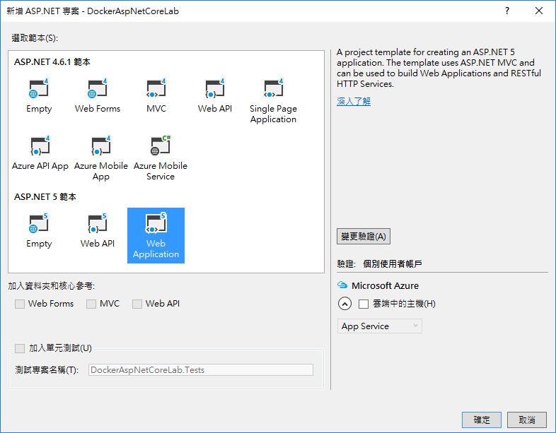

## 工作 3. 加入 Docker 的支援 ##

這個工作必須要安裝 Visual Studio Tools for Docker 才會有作用。

在方才建立的 ASP.NET Core 應用程式上按右鍵，選擇加入，然後選擇 Docker Support，這時 Visual Studio 會
加入一些 Docker 有關的資源到專案裡面。

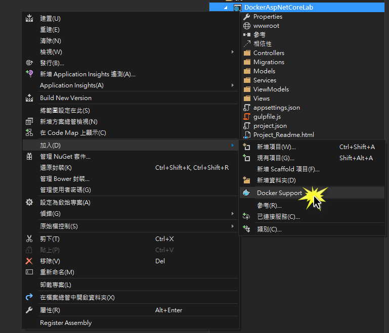

加入完成後，你會看到 Properties 有新增一些檔案，以及多了一個 Docker 資料夾。

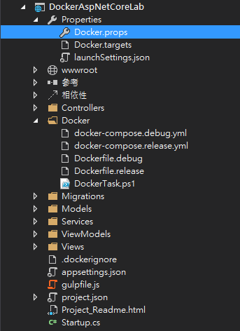

你稍後會改到 Docker.props 這個檔案。

## 工作 4. 部署 Azure 的 Docker VM ##

這個工作必須使用 Docker Toolbox (裡面內含了 docker-machine 這個指令) 才能完成，因此必須要先安裝好。

### Step 1. ###
開啟 [Azure Portal](http://portal.azure.com)，並使用你的 Azure 帳戶登入，然後按下左邊的鑰匙圖示，打開訂用帳戶
清單，並且將你的帳戶的訂用帳戶ID複製起來，稍後會用到。

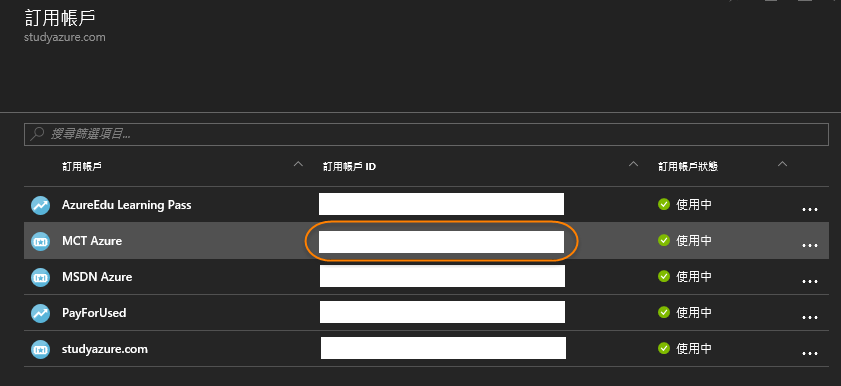

### Step 2 ###
開啟命令提示字元，輸入`docker-machine create -d azure --help`指令，你會看到完整的 azure docker driver 所提供給
create 指令的可用參數。

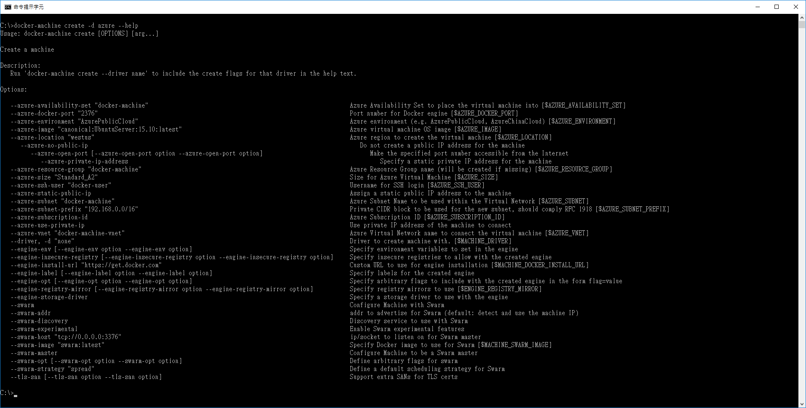

若要在 Azure 上建立 Docker VM 的同時一併在 docker machine 上註冊，就要用 docker-machine 指令來新增，若是現有的
VM，則要用不同的方法才能加入 Docker Machine。 (https://blog.dahanne.net/2015/10/07/adding-an-existing-docker-host-to-docker-machine-a-few-tips/)

雖然 docker-machine 的 Azure Driver 有很多參數，但其實幾乎都有預設值，所以原則上你只需要下這個指令：

    docker-machine create [DockerMachineName] -d azure --azure-subscription-id "你的訂用帳戶代碼"
    
就可以在 Azure 上建立出執行 Docker 的 VM，並且在 docker-machine 中註冊。

**請注意，機器的名稱必須全部小寫字母與數字**。

這是因為 azure driver 中並沒有可設定 OS Disk 的名稱的參數，若使用不
符合 Azure Storage 名稱規範的命名，會讓 create 的流程失敗，屆時還要先用 `docker-machine rm --force` 先砍掉該 
machine 才能重新做，為避免麻煩，所以要照 Azure Storage 的規定來命名。

在 docker-machine 執行的過程中，若這台電腦還沒有登入過 Azure，會被要求使用 Azure 的 Device Login 登入，請依照
畫面的提示進行，完成登入後就會自動進行後面的程序。docker-machine 建立 Azure Docker VM 的時間大約要 10-15 分鐘。

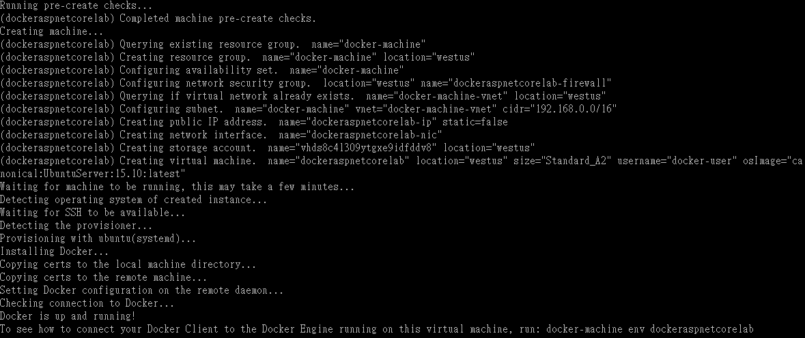

指令跑完後，可再下`docker-machine ls`來確認是否成功。

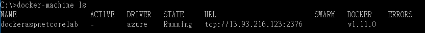

虛擬機器建置完成後，要記得到虛擬機器的網路安全群組打開 HTTP Port 80，最快的方式是由資源群組進去 (Docker Machine Azure Provider
的預設資源群組名稱是 docker-machine)。

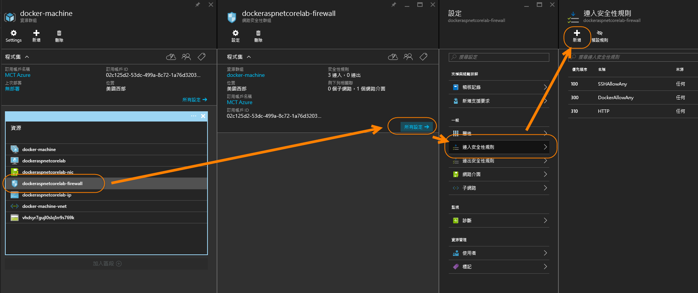

## 工作 5. 修改 Docker.target，加入 Docker Machine 的名稱 ##

請打開專案中的 Docker.props，找到 `<DockerMachineName></DockerMachineName>` 這個元素，將原本的 `default` 修改為你方才使用 
docker-machine 指令建立 Docker VM 時所取的機器名稱，若忘記了，可執行 `docker-machine ls` 來取得。

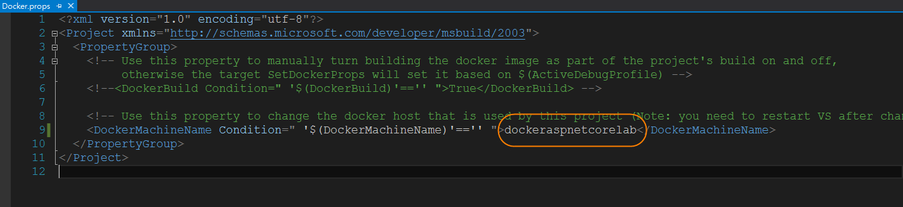

修改完畢後，**請務必重新啟動 Visual Studio**，否則對 Docker.props 的修改不會生效。

## 工作 6. 部署 ASP.NET Core 應用程式到 Docker VM ##

當 Visual Studio 重新啟動完成後，再次開啟 ASP.NET Core 專案，然後將啟動除錯器的按鈕下拉改成 Docker，同時將模式切換成 Release。

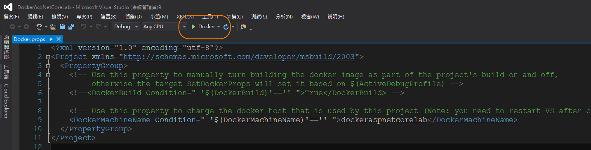

然後按下它，Visual Studio 就會開始一連串的部署程序。

準備完成後，PowerShell 會啟動指令並完成後續的程序。

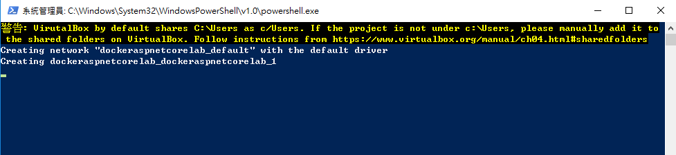

部署完成時會打開瀏覽器，顯示 ASP.NET Core 應用程式。

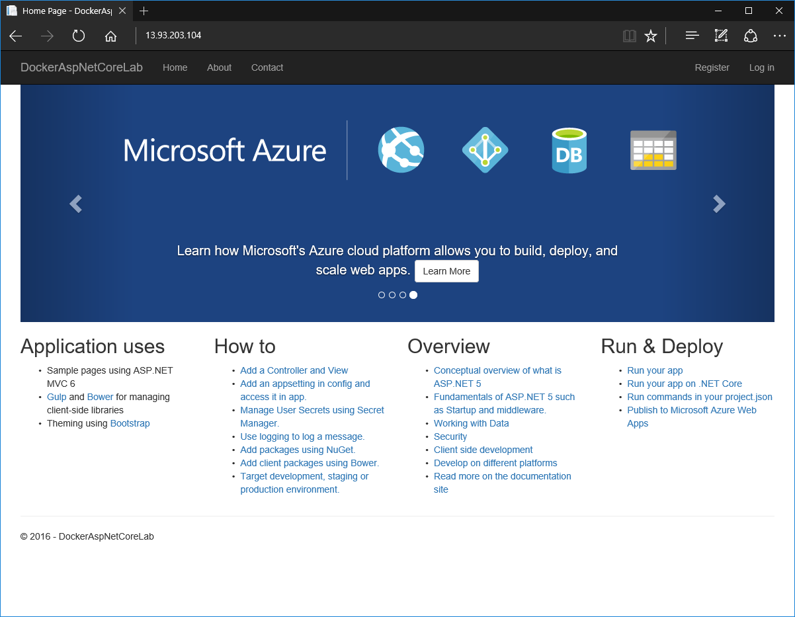 

# 總結 #
本實驗實作了將 ASP.NET Core 應用程式部署到 Azure Docker VM 的過程，除了能體驗 ASP.NET Core 的跨平台能力，也間接的學習如何使用 
`docker-machine` 指令來建置 Azure Docker VM 的方法。